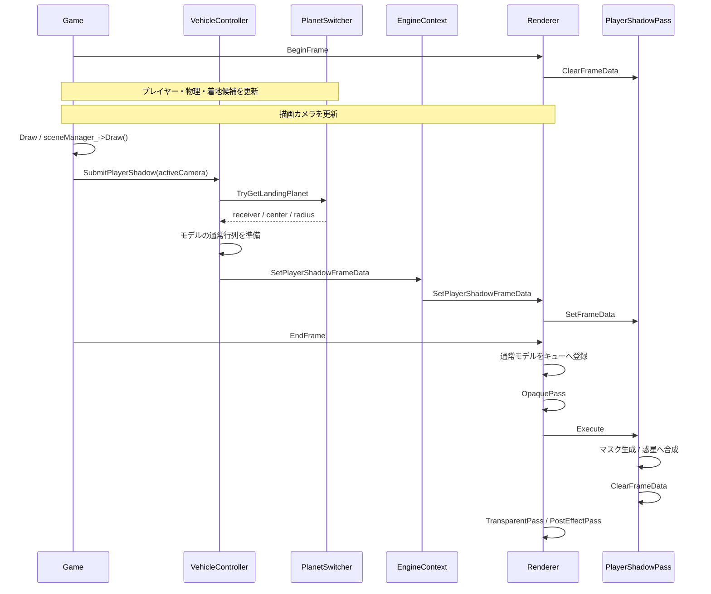

# 惑星に投影するプレイヤーのシルエット影：実装解説

作成日：2026-09-26

この文書は、現在のプロジェクトに実装されている `PlayerShadowPass` と、その呼び出し元を説明するものです。対象は、プレイヤーの着地位置を見やすくするためのシルエット影です。ユーザーによるゲーム画面での表示確認後のコードを基準としています。

影は、プレイヤーを白く描いた専用テクスチャを作り、そのテクスチャを惑星の表面へ投影して実現しています。通常描画の `Object3d` シェーダーへ影処理を追加せず、専用パスと専用シェーダーで重ね描きします。

## 目次

1. 方式の概要と投影方向
2. ファイルと責務
3. 1フレームの流れ
4. ゲーム側で影の情報を集める
5. GPUリソースと定数バッファ
6. 影用カメラの計算
7. プレイヤーのマスクを描く
8. 惑星へマスクを投影する
9. シェーダー・Root Signature・PSOの対応
10. 描画先の復帰とリソースの寿命
11. 現在の設定値と調整方法
12. 影が出なかった原因と確認手順
13. 現在の制約と拡張箇所
14. コードを読む・再実装する順番

## 1. 方式の概要と投影方向

### 1.1 二段階で描画する

処理を大きく分けると、次の二段階です。

| 段階 | 描くもの | 描画先 | 出力 |
|---|---|---|---|
| マスク生成 | プレイヤーのメッシュ | 専用の小さなテクスチャ | 背景が黒、プレイヤーのシルエットが白 |
| 影の合成 | 影を受ける惑星のメッシュ | 通常シーンの描画先 | マスクの白い部分に対応する惑星表面を暗くする |

惑星をもう一度描くときは、通常画面と同じ位置へ描画します。同時に「この惑星表面は、影用カメラから見たマスクのどこに対応するか」を計算します。

平らな板に影画像を貼る方式ではないため、合成結果は惑星の実際の三角形メッシュに沿います。ただし、投影の基準点を求める部分は球形惑星を仮定しています。

### 1.2 プレイヤーと惑星中心を結ぶ直線を基準にする

以下の記号を使います。

| 記号 | 意味 |
|---|---|
| `P` | プレイヤーのワールド位置 |
| `C` | 選択した惑星の中心 |
| `R` | 惑星の半径 |
| `U` | 惑星中心からプレイヤーへ向かう単位ベクトル |
| `D` | 影を投影する方向 |
| `G` | 真下の地表に置く投影基準点 |

計算は次のとおりです。

```text
U = normalize(P - C)
D = -U
G = C + U * R
```

`P`、`G`、`C` は同じ直線上にあります。

```text
E：影用カメラ
│
P：プレイヤー
│  投影方向 D
▼
G：プレイヤー側の惑星表面
│
C：惑星中心
```

この直線は影の投影軸です。モデルの各頂点は、この軸と平行な方向へ投影されます。各頂点から惑星中心へ線を引いて収束させる処理ではありません。

また、シルエットが左右非対称だったり、モデルの原点が見た目の中心からずれていたりする場合、影画像の見た目の重心は `G` と一致するとは限りません。

### 1.3 現在の「重力方向」の意味

現在のパスは `GravityBody` の重力ベクトルを直接読みません。`P - C` から、その惑星の中心へ向かう方向を計算します。

球形惑星が中心へ引く重力なら、意図した真下と一致します。複数の重力を合成した方向や、中心以外へ引く重力に対応するには、入力データと投影基準点の計算を変更する必要があります。

着地候補は `PlanetSwitcher` が選びます。空中で次の惑星が候補になった場合は、その候補の中心方向へ影が切り替わります。

### 1.4 深度シャドウマップとの違い

この専用テクスチャに入るのは「プレイヤーが写っているか」という白黒のマスクです。光源からの距離は保存しません。

そのため、太陽光の方向による影や、途中の障害物が影を遮る計算は行いません。選んだ惑星に、着地位置の目印としてプレイヤーの輪郭を表示する設計です。ジャンプ後の移動を予測した将来の着地地点でもなく、現在位置から見た真下を示します。

## 2. ファイルと責務

### 2.1 C++側

| ファイル | 主な関数・データ | 担当 |
|---|---|---|
| [PlayerShadowPass.h](C:/Users/k024g/OneDrive/ドキュメント/LE3/MyEngine/Project/GameEngine/Graphics/Renderer/Pass/PlayerShadowPass.h) | `PlayerShadowSettings`、`PlayerShadowFrameData`、`PlayerShadowPass` | 影の入力、設定、専用GPU資源を定義 |
| [PlayerShadowPass.cpp](C:/Users/k024g/OneDrive/ドキュメント/LE3/MyEngine/Project/GameEngine/Graphics/Renderer/Pass/PlayerShadowPass.cpp) | `Initialize`、`Execute`、各描画処理 | マスク生成から惑星への合成まで実行 |
| [Renderer.h](C:/Users/k024g/OneDrive/ドキュメント/LE3/MyEngine/Project/GameEngine/Graphics/Renderer/Renderer.h) | 影データの登録API、`playerShadowPass_` | ゲーム側から影パスへ入力を渡す窓口 |
| [Renderer.cpp](C:/Users/k024g/OneDrive/ドキュメント/LE3/MyEngine/Project/GameEngine/Graphics/Renderer/Renderer.cpp) | `BuildDefaultPasses`、`BeginFrame`、`EndFrame` | パスの所有、実行順、フレーム境界を管理 |
| [FrameContext.h](C:/Users/k024g/OneDrive/ドキュメント/LE3/MyEngine/Project/GameEngine/Graphics/Renderer/Pass/FrameContext.h) | `FrameContext` | デバイス、PSO管理、描画先、キャッシュ無効化関数をパスへ渡す |
| [OffscreenRenderTarget.h](C:/Users/k024g/OneDrive/ドキュメント/LE3/MyEngine/Project/GameEngine/Graphics/Device/OffscreenRenderTarget.h) / [OffscreenRenderTarget.cpp](C:/Users/k024g/OneDrive/ドキュメント/LE3/MyEngine/Project/GameEngine/Graphics/Device/OffscreenRenderTarget.cpp) | `BindPreservingContents` | 色・深度を消さず、シーンの描画先へ戻す |
| [EngineContext.h](C:/Users/k024g/OneDrive/ドキュメント/LE3/MyEngine/Project/GameEngine/Framework/EngineContext.h) / [EngineContext.cpp](C:/Users/k024g/OneDrive/ドキュメント/LE3/MyEngine/Project/GameEngine/Framework/EngineContext.cpp) | `SetPlayerShadowFrameData`、`ClearPlayerShadowFrameData` | ゲームとRendererを中継 |
| [PlanetSwitcher.h](C:/Users/k024g/OneDrive/ドキュメント/LE3/MyEngine/Project/GameProject/App/Component/Gravity/PlanetSwitcher.h) / [PlanetSwitcher.cpp](C:/Users/k024g/OneDrive/ドキュメント/LE3/MyEngine/Project/GameProject/App/Component/Gravity/PlanetSwitcher.cpp) | 3引数の `TryGetLandingPlanet` | 同じ着地候補からモデル・中心・半径を取得 |
| [VehicleController.h](C:/Users/k024g/OneDrive/ドキュメント/LE3/MyEngine/Project/GameProject/App/Component/Vehicle/VehicleController.h) / [VehicleController.cpp](C:/Users/k024g/OneDrive/ドキュメント/LE3/MyEngine/Project/GameProject/App/Component/Vehicle/VehicleController.cpp) | `TryBuildPlayerShadowFrameData`、`SubmitPlayerShadow` | プレイヤーと惑星を準備し、影データを送信 |
| [Game.cpp](C:/Users/k024g/OneDrive/ドキュメント/LE3/MyEngine/Project/GameProject/Game.cpp) | `Game::Draw` | 更新後に毎フレーム送信する |

### 2.2 HLSL側

| ファイル | 担当 |
|---|---|
| [PlayerShadow.hlsli](C:/Users/k024g/OneDrive/ドキュメント/LE3/MyEngine/Project/Resources/engine/shaders/graphics/player_shadow/PlayerShadow.hlsli) | 定数バッファと頂点入出力の共通構造体 |
| [PlayerShadowMask.VS.hlsl](C:/Users/k024g/OneDrive/ドキュメント/LE3/MyEngine/Project/Resources/engine/shaders/graphics/player_shadow/PlayerShadowMask.VS.hlsl) | プレイヤー頂点を影用カメラの座標へ変換 |
| [PlayerShadowMask.PS.hlsl](C:/Users/k024g/OneDrive/ドキュメント/LE3/MyEngine/Project/Resources/engine/shaders/graphics/player_shadow/PlayerShadowMask.PS.hlsl) | プレイヤーを白で出力 |
| [PlayerShadowProject.VS.hlsl](C:/Users/k024g/OneDrive/ドキュメント/LE3/MyEngine/Project/Resources/engine/shaders/graphics/player_shadow/PlayerShadowProject.VS.hlsl) | 惑星頂点の画面座標・ワールド座標・影用座標を生成 |
| [PlayerShadowProject.PS.hlsl](C:/Users/k024g/OneDrive/ドキュメント/LE3/MyEngine/Project/Resources/engine/shaders/graphics/player_shadow/PlayerShadowProject.PS.hlsl) | 投影範囲を判定し、マスクから黒い影を合成 |

### 2.3 登録と描画設定

| ファイル | 担当 |
|---|---|
| [shader_registry.json](C:/Users/k024g/OneDrive/ドキュメント/LE3/MyEngine/Project/Resources/engine/shaders/shader_registry.json) | 専用VS/PSを `PlayerShadowMask`、`PlayerShadowProject` の名前で登録 |
| [pipeline_registry.json](C:/Users/k024g/OneDrive/ドキュメント/LE3/MyEngine/Project/Resources/engine/pipelines/pipeline_registry.json) | 以下のRoot Signature・PSO定義を読み込み対象に登録 |
| [player_shadow_mask_rootsig.json](C:/Users/k024g/OneDrive/ドキュメント/LE3/MyEngine/Project/Resources/engine/pipelines/root_signatures/graphics/player_shadow_mask_rootsig.json) | マスク用定数バッファの束縛 |
| [player_shadow_project_rootsig.json](C:/Users/k024g/OneDrive/ドキュメント/LE3/MyEngine/Project/Resources/engine/pipelines/root_signatures/graphics/player_shadow_project_rootsig.json) | 合成用定数・マスクSRV・サンプラーの束縛 |
| [player_shadow_mask_pipeline.json](C:/Users/k024g/OneDrive/ドキュメント/LE3/MyEngine/Project/Resources/engine/pipelines/pso/graphics/player_shadow_mask_pipeline.json) | マスク用のRT形式、深度、ブレンド、カリング |
| [player_shadow_project_pipeline.json](C:/Users/k024g/OneDrive/ドキュメント/LE3/MyEngine/Project/Resources/engine/pipelines/pso/graphics/player_shadow_project_pipeline.json) | シーンへ重ねるための深度EQUALとアルファ合成 |
| [GameTest.json](C:/Users/k024g/OneDrive/ドキュメント/LE3/MyEngine/Project/Resources/game/scenes/GameTest.json) | プレイヤー・惑星のコンポーネント、惑星の不透明設定 |

一部のソースコメントに「宣言のみ」「未実装」「別途実装が必要」という記述が残っていますが、この文書で説明する中継関数、シェーダー本体、描画先の復帰処理は実装されています。

## 3. 1フレームの流れ



図を表示できないMarkdownビューアーでは、次の実行順を基準にしてください。

```text
BeginFrame
  → ゲーム更新
  → カメラ更新
  → Game::Drawで影データを登録
  → EndFrameで通常描画をキュー化
  → OpaquePass
  → PlayerShadowPass
  → TransparentPass
  → PostEffectPass
```

`Game::Draw()` からの登録は、GPUへ影を描く操作ではありません。実際の影描画は、`Renderer::EndFrame()` がパスを実行するときに行われます。

`VehicleController::Update()` の途中で登録せず、最終的な位置と描画カメラがそろった後に登録することで、通常描画と影のずれを避けます。

## 4. ゲーム側で影の情報を集める

### 4.1 PlayerShadowFrameData

```cpp
struct PlayerShadowFrameData {
    Model* player = nullptr;
    Model* receiver = nullptr;
    Camera* camera = nullptr;
    Vector3 playerPosition{};
    Vector3 planetCenter{};
    float planetRadius = 0.0f;
};
```

| フィールド | 必要な理由 |
|---|---|
| `player` | マスクに描くメッシュと、現在のワールド行列を取得する |
| `receiver` | 影を重ねる惑星メッシュと、通常描画の行列を取得する |
| `camera` | 通常描画と同じカメラでモデルを準備するための入力。影パス内で別の通常カメラ行列を組み直すためには使わない |
| `playerPosition` | 影用カメラの配置と投影方向を計算する |
| `planetCenter` | 中心へ向かう方向を計算する |
| `planetRadius` | 球形を仮定した地表基準点を計算する |

モデルとカメラのポインターは借用です。この構造体をコピーしても、モデル自体を複製したり、寿命を延ばしたりすることはありません。

### 4.2 PlanetSwitcher::TryGetLandingPlanet

3引数版は、受け面のモデルも一緒に返します。

```cpp
bool TryGetLandingPlanet(
    GameEngine::Model*& outReceiver,
    GameEngine::Vector3& outCenter,
    float& outSurfaceRadius) const;
```

処理は次の順番です。

1. 出力を `nullptr`、ゼロ座標、半径ゼロへ初期化する。
2. `pendingIndex_` が有効なら空中の候補を使い、そうでなければ `currentIndex_` を使う。
3. インデックスが候補配列の範囲内か確認する。
4. 候補のEntity IDまたは名前から、登録済みモデルを再検索する。
5. 同じ候補の中心と半径を取得する。
6. 有限値と正の半径を確認して返す。

中心と半径だけを返す既存の2引数版も残します。既存の着地判定やカメラ処理が使っているためです。

ここで重要なのは、`receiver`、`planetCenter`、`planetRadius` を同じ候補から取得することです。モデルだけ前の惑星のままだと、投影先と計算上の地表が一致しません。

### 4.3 中心と半径の現在の前提

現在の補助関数は、次の値を使います。

```text
center = model->GetPosition()
radius = max(abs(scale.x), abs(scale.y), abs(scale.z)) * 0.5
```

この計算が球の見た目と正確に合うのは、親なし・原点が球の中心・元の球の半径が0.5・XYZが同じ正のスケール、という構成です。

プリミティブの `sphereRadius` を変更しても、この半径計算には自動反映されません。また、ここでは親のワールド変換を合成していません。楕円体や任意のインポートモデルにも、そのまま正確には対応しません。

対応を広げる場合は、影だけに別の半径を持たせる前に、着地判定と共有している中心・半径の取得規約を見直してください。

### 4.4 VehicleController::TryBuildPlayerShadowFrameData

この関数は入力の組み立てを担当します。

- 所有オブジェクト、コンポーネントの有効状態、カメラを確認する。
- 所有オブジェクトを `Model` として取得する。
- 同じ所有オブジェクトの `PlanetSwitcher` を取得する。
- 惑星モデル・中心・半径を取得する。
- プレイヤーと受け面が同じモデルでないことを確認する。
- `player->GetWorldMatrix()` の `m[3][0..2]` から位置を取得する。
- 有限値を確認して構造体を埋める。

ここで使う位置は、現在のObject/Transformのワールド行列が表す原点です。メッシュの見た目の重心を計算しているわけではありません。

### 4.5 VehicleController::SubmitPlayerShadow

入力を作った後、プレイヤーと惑星の両方を準備します。

1. `MeshComponent` と `TransformComponent` を確認する。
2. プリミティブなら `EnsureMesh()`、ファイルモデルなら読み込み済みアセットを確認する。
3. 親行列を反映する。
4. 通常の描画カメラで `UpdateMatrix(camera)` を呼ぶ。
5. 行列バッファが利用できることを確認する。
6. `EngineContext::SetPlayerShadowFrameData()` へ渡す。

失敗した場合は登録を解除します。前の対象の影を残して描く処理にはしません。

通常行列をここで準備するのは、通常描画が省略されたモデルにも現在の姿勢を使えるようにするためです。影用カメラの行列を通常モデルのWVPへ書き込んではいけません。

アニメーションの時間は通常の更新で進めます。影のためにもう一度アニメーション更新を行うと、1フレームで二重に進むため、ここでは行いません。

### 4.6 Game::Drawと中継API

現在の `Game::Draw()` は、シーンのDraw後にアクティブカメラを取得し、登録済みモデルから `VehicleController` を探して、最初の1体を送信します。カウントダウン中は操作ロックでコンポーネントが無効でも影を送信します。

この検索は、操作対象が1体の構成を前提にしています。複数の車両に同じコンポーネントを付ける場合は、操作中プレイヤーのEntity IDなどで選択する必要があります。

中継は次の経路です。

```text
VehicleController
  → EngineContext::SetPlayerShadowFrameData
  → Renderer::SetPlayerShadowFrameData
  → PlayerShadowPass::SetFrameData
```

`SetPlayerShadowFrameData()` の `true` は、パスへ登録できたという意味です。範囲判定や描画条件まで通過したことは保証しません。

## 5. GPUリソースと定数バッファ

### 5.1 マスク用テクスチャ

`CreateMaskResources()` が作ります。

| 項目 | 現在の仕様 |
|---|---|
| 形式 | `DXGI_FORMAT_R8G8B8A8_UNORM` |
| サイズ | 設定値。現在は256×256 |
| ミップ数 | 1 |
| サンプル数 | 1 |
| Resource Flag | `ALLOW_RENDER_TARGET` |
| 初期の追跡状態 | `PIXEL_SHADER_RESOURCE` |
| クリア色 | RGBAすべて0 |
| RTV | 専用の1スロットのRTVヒープ |
| SRV | エンジン共通のshader-visible SRVヒープから確保 |

RTVは「このテクスチャへ描くためのビュー」、SRVは「このテクスチャをシェーダーから読むためのビュー」です。同じテクスチャに対して、用途の異なるビューを作っています。

既存シーンのRTVスロットを上書きしないよう、RTVヒープを専用にしています。一方、SRVは共通ヒープに配置し、他のシェーダー用ディスクリプターとの切り替えを複雑にしません。

リソース作成時の `clearValue` は最適化用の情報であり、実際に画像を黒で塗る命令ではありません。最初の `ClearRenderTargetView()` までは、画像内容が初期化されたものとして扱いません。

### 5.2 定数バッファは3個

`CreateConstantBuffers()` がUPLOADヒープ上に作り、MapしたCPUポインターを保持します。

| C++の構造体 | データサイズ | 確保サイズ | 内容 |
|---|---:|---:|---|
| `MaskConstants` | 64バイト | 256バイト | プレイヤーの影用WVP |
| `ProjectConstants` | 256バイト | 256バイト | 惑星の通常WVP、World、法線行列、影用VP |
| `ShadowParameters` | 32バイト | 256バイト | 外向き方向・濃さ、地表基準点・許可範囲 |

確保サイズはCBVのアラインメントに合わせて256バイト単位に切り上げます。

```cpp
alignedBytes = (bytes + 255u) & ~size_t(255u);
```

C++とHLSLのメンバー順をそろえます。特に `ProjectConstants` の4行列は、両側とも次の順番です。

```text
worldViewProjection
world
worldInverseTranspose
shadowViewProjection
```

`ShadowParameters` は `Vector4 / float4` を2個使い、XYZとWへ次のように格納します。

```text
shadowUpAndOpacity     = (Ux, Uy, Uz, opacity)
groundPositionAndRange = (Gx, Gy, Gz, receiverRange)
```

行列はCPU・HLSLともrow-majorの規約です。変換の積は `頂点 * 行列` の順でそろえます。

## 6. 影用カメラの計算

実装箇所は `UpdateShadowProjection()` です。

### 6.1 投影できる状態か確認する

まず、中心とプレイヤーが同一点でないこと、値が有限であること、半径や設定が有効であることを確認します。

次に、影用カメラから真下の地表までの距離を求めます。

```text
distance    = length(P - C)
groundDepth = cameraDistance + distance - R
```

現在は、以下の場合に描画を中止します。

- `distance < R`：プレイヤーの原点が計算上の惑星内部にある。
- `groundDepth < nearClip`：基準点が近クリップ面より手前にある。
- `groundDepth > farClip`：基準点が遠クリップ面より奥にある。

この検査は地表の基準点に対するものです。プレイヤーの全頂点や、影が広がる範囲の地表全体が入ることまでは保証しないため、設定には余裕を持たせます。

### 6.2 カメラ位置と向き

```text
eye    = P + U * cameraDistance
target = P
forward = normalize(target - eye) = -U
```

プレイヤーから惑星と反対側へ離した場所にカメラを置き、プレイヤーを見ることで、カメラの前方が惑星中心方向になります。

ここで作るのは行列です。通常ゲーム画面のアクティブカメラを切り替える処理ではありません。

### 6.3 極付近での向きの安定化

LookAt行列には前方だけでなく、画面の上方向を定めるベクトルも必要です。この上方向を固定の世界Y軸にすると、前方と平行になる場所で外積がゼロになり、カメラの向きを作れなくなります。

現在は、前フレームの画面上方向 `previousTangentUp_` を、新しい地表の接平面へ射影しています。

```text
T = previousTangentUp - U * dot(previousTangentUp, U)
T = normalize(T)
```

`U` 方向の成分を取り除くと、`T` は地表に沿う方向になります。これをLookAtの上方向に使います。

長さがほぼゼロになる場合は、`U` と平行になりにくい世界Y軸またはX軸を選び直します。通常の移動では前フレームとの連続性を保ち、退化するときには代替軸で立て直す設計です。

### 6.4 正投影行列

現在のエンジンの関数は、引数順が `left, top, right, bottom, nearClip, farClip` です。

```cpp
const Matrix4x4 view =
    MakeLookAtMatrix(eye, playerPosition, tangent);

const Matrix4x4 projection = MakeOrthographicMatrix(
    -projectionWidth * 0.5f,
     projectionHeight * 0.5f,
     projectionWidth * 0.5f,
    -projectionHeight * 0.5f,
     nearClip,
     farClip);

shadowViewProjection = view * projection;
```

正投影には遠近による拡大縮小がありません。高度が上がったことだけを理由に、マスク内のプレイヤーを小さくする処理は入りません。

ただし、モデルの姿勢や惑星表面の曲率によって、地表上の影の輪郭は変わります。高度に応じたフェードやぼかしも、現在は別途行っていません。

## 7. プレイヤーのマスクを描く

### 7.1 描画対象のメッシュを集める

`CollectGeometry()` は、描画する頂点バッファ・インデックスバッファ・インデックス数を集めます。

| モデルの種類 | 使用する情報 |
|---|---|
| プリミティブ | `MeshComponent::GetMesh()` の頂点・インデックス |
| ファイルモデル | `ModelAsset` の各サブメッシュの頂点・インデックス |

描画対象は三角形リストです。頂点のストライド、インデックス形式、インデックス数、バッファ容量などを検証してから描画します。

影パス中にファイル読み込みやプリミティブ生成は行いません。必要な準備は呼び出し側で済ませます。

### 7.2 スキニングするプレイヤー

`PreparePlayerVertices()` は、スキニングが有効なモデルに対して既存の `SkinningCompute` を使います。

```text
ボーンPalette・入力頂点・ウェイトを確認
    ↓
出力頂点バッファをUNORDERED_ACCESSへ遷移
    ↓
Compute Shaderで頂点変形
    ↓
VERTEX_AND_CONSTANT_BUFFERへ遷移
    ↓
変形後の頂点バッファをマスク描画に使う
```

ボーンPalette自体は通常のアニメーション更新で準備します。影パスは、現在のPaletteから頂点を計算します。

現状は通常描画側と「このフレームで計算済みか」という情報を共有していないため、通常描画でもComputeを実行していた場合に重複する可能性があります。現在のポーズを確実に使うことを優先した構成です。

必要なスキニング資源がそろっていない場合は、古い姿勢を使う代わりに影をスキップします。

### 7.3 プレイヤーの影用WVP

`UpdateConstantBuffers()` で次を作ります。

```text
playerShadowWVP = playerWorld * shadowViewProjection
```

`playerWorld` は、通常描画用に準備されているモデルのWorldを読み取ります。影パスでは通常モデルのWorldやWVPを書き換えません。

Mask VSは、この合成済み行列で頂点を変換します。

```hlsl
output.position =
    mul(input.position, gMaskConstants.playerShadowWVP);
```

### 7.4 描画先と描画状態

`DrawPlayerMask()` が次の処理を行います。

1. マスクを `PIXEL_SHADER_RESOURCE` から `RENDER_TARGET` へ遷移する。
2. 専用RTVを設定し、DSVは設定しない。
3. テクスチャを黒でクリアする。
4. ViewportとScissorをマスク解像度にする。
5. マスク用Root Signature、PSO、定数バッファを設定する。
6. プレイヤーの各サブメッシュを描く。
7. マスクを `PIXEL_SHADER_RESOURCE` へ戻す。

Mask PSの出力は次のとおりです。

```hlsl
return float4(1.0f, 1.0f, 1.0f, 1.0f);
```

どの面が手前かに関係なく、プレイヤーが写った画素を白にすれば輪郭が得られます。そのため、この描画では深度テストとブレンドを無効にし、カリングも `None` にしています。

プレイヤーの色や元のテクスチャは参照しません。メッシュ内部の穴は形状どおりに写りますが、テクスチャのアルファで切り抜いた穴は現在のマスクには反映されません。

## 8. 惑星へマスクを投影する

### 8.1 通常シーンと影用カメラの両方へ変換する

`PlayerShadowProject.VS.hlsl` は、同じ惑星頂点から複数の座標を作ります。

```hlsl
// 通常画面に表示する位置。
output.position =
    mul(input.position, gProjectConstants.worldViewProjection);

// 投影先となる惑星表面のワールド位置。
float4 worldPosition =
    mul(input.position, gProjectConstants.world);

output.worldPosition = worldPosition.xyz;

// ワールド空間の法線。
output.worldNormal = normalize(
    mul(input.normal,
        (float3x3)gProjectConstants.worldInverseTranspose));

// 同じ表面を、影用カメラから見た位置。
output.shadowPosition =
    mul(worldPosition, gProjectConstants.shadowViewProjection);
```

通常の画面座標は、その画素を画面のどこへ描くかを決めます。影用の座標は、その画素がマスク画像のどこに対応するかを決めます。

### 8.2 影用クリップ座標からUVを作る

PSで透視除算を行い、NDCへ変換します。

```hlsl
float3 ndc = input.shadowPosition.xyz / input.shadowPosition.w;
```

現在の行列は正投影ですが、クリップ座標からNDCへ変換する形で統一しています。

この投影で使用する範囲は次のとおりです。

```text
-1 <= ndc.x <= 1
-1 <= ndc.y <= 1
 0 <= ndc.z <= 1
```

範囲外は `discard` します。範囲内では、XYをテクスチャの0～1へ変換します。

```hlsl
float2 uv = ndc.xy * float2(0.5f, -0.5f) + 0.5f;
```

| NDC XY | UV |
|---|---|
| `(-1, +1)`：左上 | `(0, 0)` |
| `(0, 0)`：中央 | `(0.5, 0.5)` |
| `(+1, -1)`：右下 | `(1, 1)` |

Y方向は、この式で一度反転させます。CPU側などで追加のY反転を入れると、上下の対応が崩れます。

### 8.3 惑星の反対側へ影が出るのを防ぐ

白黒マスクには、光線が最初に地表へ当たる距離が入っていません。そのままでは、同じ投影線上にある反対側の表面にも対応するマスク値が存在します。

そこで、ワールド法線 `N` と外向き方向 `U` の内積を使います。

```hlsl
if (dot(normalize(input.worldNormal), shadowUp) <= 0.0f) {
    discard;
}
```

プレイヤー側を向く面だけを残します。正しい外向き法線を持つ球形惑星を前提にした判定です。

### 8.4 真下の地表付近へ範囲を限定する

さらに、地表基準点 `G` からの距離で合成範囲を制限します。

```hlsl
float3 offset = input.worldPosition - groundPosition;

if (dot(offset, offset) > receiverRange * receiverRange) {
    discard;
}
```

これはワールド空間の直線距離です。惑星表面に沿った弧の長さではありません。

`receiverRange` は、マスクにプレイヤーを撮影する範囲ではなく、マスクを受け取ってよい表面の範囲です。影を円形に描く処理でもありません。最終的な輪郭はマスクで決まり、この距離判定は許可範囲の外側を切ります。

### 8.5 マスクを読んで黒く合成する

```hlsl
float mask =
    gShadowMask.SampleLevel(gShadowSampler, uv, 0.0f).r;

float alpha = saturate(mask * opacity);
return float4(0.0f, 0.0f, 0.0f, alpha);
```

マスクのRチャンネルを使います。

| マスク値 | 結果 |
|---:|---|
| 0 | アルファ0。元のシーン色をそのまま残す |
| 1 | `opacity` の濃さで黒を重ねる |
| 0～1の中間 | 輪郭の補間値に応じて部分的に暗くする |

通常のアルファ合成なので、RGBの結果は概念的に次の式です。

```text
resultRGB = blackRGB * alpha + sceneRGB * (1 - alpha)
          = sceneRGB * (1 - alpha)
```

例えばマスク値1、`opacity = 0.9` なら、ポストエフェクト適用前のその部分のRGBは元の約10%になります。

現在は1ミップの線形サンプリングです。輪郭の画素間を補間しますが、距離に応じたソフトシャドウや複数画素を広く使うぼかしではありません。

### 8.6 深度EQUALが必要な理由

合成のPSOは、深度比較が `Equal`、深度書き込みが `Zero` です。

1. OpaquePassで通常の惑星を描き、色と深度を残す。
2. 同じ惑星メッシュを、同じ通常カメラのWVPで再描画する。
3. 深度が一致する画素だけ、黒い影を合成する。
4. 深度自体は変更しない。

手前に別の不透明物があれば、そこに保存されている深度と惑星の深度が一致しないため、その画素へ影を重ねません。

ここで使うWVPは、通常描画の `receiver->wVP` をそのまま専用定数バッファへコピーします。通常VSと影のProject VSの画面座標の計算式も、同じ `mul(position, WVP)` です。

受け面を通常VSだけで変形する、別の行列を使う、深度を途中でクリアする、といった変更は、この一致を壊します。

## 9. シェーダー・Root Signature・PSOの対応

### 9.1 バインディング一覧

| パス | HLSLのレジスター | ステージ | JSONのsemantic | 内容 |
|---|---|---|---|---|
| Mask | `b0` | Vertex | `shadowmaskconstants` | `PlayerShadowMaskConstants` |
| Project | `b0` | Vertex | `shadowprojectconstants` | `PlayerShadowProjectConstants` |
| Project | `b1` | Pixel | `shadowparameters` | `PlayerShadowParameters` |
| Project | `t0` | Pixel | `shadowmask` | マスクのSRV |
| Project | `s0` | Pixel | 静的サンプラー | 線形補間、Border、Mip 0 |

`b0` や `t0` はHLSLのレジスター番号で、Root Parameterの配列インデックスとは別物です。

`PrepareBindings()` は、`ResolvePipelineRootParameter()` にsemanticを渡して、実際のRoot indexを取得します。Root Signatureの定義順が変わっても、C++に固定値を書かずに対応するためです。

### 9.2 PSOの違い

| 設定 | PlayerShadowMask | PlayerShadowProject |
|---|---|---|
| RTV形式 | `R8G8B8A8_UNORM` を明示 | 通常シーンの形式を継承 |
| 深度テスト | 無効 | 有効 |
| 深度比較 | `Always` | `Equal` |
| 深度書き込み | `Zero` | `Zero` |
| ブレンド | `None` | `Normal` |
| カリング | `None` | `Back` |
| トポロジー | Triangle | Triangle |
| モデル用パイプラインとして公開 | `modelCompatible = false` | `modelCompatible = false` |

通常マテリアルにこれらの専用パイプラインを割り当てる必要はありません。影パス自身が選択して設定します。

惑星の `reverseFaces` が有効な場合は、`PlayerShadowProject_ReversedFace` を選び、通常描画の面の向きに合わせます。ただし、法線による投影面の判定もあるため、内向きの球を一般的な受け面として想定しているわけではありません。

### 9.3 登録の確認

起動時に次が必要です。

1. shader_registryで4本のVS/PSを登録する。
2. pipeline_registryで2つのRoot Signatureと2つのPSO定義を登録する。
3. PSO名、シェーダー名、Root Signature名を一致させる。
4. semanticとHLSLレジスターを一致させる。
5. マスクのRTV形式を、作成したテクスチャの形式に合わせる。

シェーダーがコンパイルできても、パイプラインやRootの束縛が正しいとは限りません。また、パイプライン作成が成功しても、受け面の描画順までは保証されません。

## 10. 描画先の復帰とリソースの寿命

### 10.1 マスク生成後に戻す状態

マスクを描いた直後は、描画先もViewportも256×256のマスク用になっています。そのまま惑星を描いてはいけません。

`RestoreSceneTarget()` から、次を呼びます。

```cpp
ctx.offscreenRenderTarget->BindPreservingContents(true);
```

この関数が復帰させるものは次のとおりです。

- 通常シーンのカラーターゲットを `RENDER_TARGET` 状態にする。
- 通常シーンのRTVを設定する。
- 既存の深度バッファを使用可能な状態にし、DSVを設定する。
- 通常シーンの解像度へViewportとScissorを戻す。
- 共通のSRVヒープを設定する。

色・深度・ステンシルはクリアしません。深度バッファのリソース状態を `DEPTH_WRITE` にすることと、PSOで深度書き込みを許可することは別です。影のPSOの `depthWriteMask = Zero` により、合成時の深度値の更新は行われません。

### 10.2 PreDrawWithoutClear(true)を使わない理由

既存の `PreDrawWithoutClear(true)` は色を保持しますが、深度はクリアします。

ここで使うと、OpaquePassが作った惑星の深度が失われます。その後のEQUAL比較が成立しないため、影用の復帰処理には使えません。

「クリアしない」という名前だけで選ばず、色と深度のどちらを保持するAPIなのか確認する必要があります。

### 10.3 状態遷移と束縛は両方必要

マスクは、1フレーム内で次の用途に切り替わります。

```text
PIXEL_SHADER_RESOURCE
    ↓ ResourceBarrier
RENDER_TARGET
    ↓ 黒でClear / プレイヤーをDraw
    ↓ ResourceBarrier
PIXEL_SHADER_RESOURCE
    ↓ 惑星を描くPSからSample
```

RTVやSRVを設定するだけでは、リソースの状態遷移は行われません。逆に、状態遷移だけしても、必要なRTVやSRVが自動で束縛されるわけではありません。

### 10.4 RendererのPSOキャッシュを無効にする

Rendererには、同じPSOの再設定を省くためのキャッシュがあります。影パスは `SetPipelineState()` やRoot Signatureの設定を直接呼ぶため、その間に実際のGPU状態とRendererの記憶が異なる状態になります。

実行後は `ctx.invalidatePipelineBindingFunc()` を呼び、後続の通常描画が必要な設定を省略しないようにします。

### 10.5 Executeの失敗処理

`Execute()` は、資源の確認、行列計算、PSOの解決、描画形状の検証を先に行います。マスクRTVへ切り替えた後の失敗箇所を少なくするためです。

後処理では、必要に応じて描画先を復帰し、PSOキャッシュを無効化し、借用していたフレームデータを解除します。通常の検証失敗や捕捉した例外では、影を中止して後続描画を継続する構成です。

### 10.6 フレームとモデルの寿命

- `Renderer::BeginFrame()` で、前フレームの影データを解除する。
- `Game::Draw()` で、そのフレームの対象を登録する。
- `PlayerShadowPass::Execute()` の最後に登録を解除する。
- 対象がないフレームは、古いモデルのポインターを使って描かない。
- 登録後、描画前にモデルを削除する場合は、削除前に登録を解除する。

現在のAPIは1体分だけを保持します。同じフレームで複数回登録した場合、最後のデータが使われます。

専用テクスチャや定数バッファの所有者は影パスです。`Renderer::ClearPasses()` は借用ポインターを解除してから所有パスを破棄します。資源を破棄する操作はGPUが利用を終えた境界で行います。

現在のフレーム末尾のGPU待機を前提に、定数バッファは各1個です。将来フレームを並列に処理する場合は、GPUが読み終わる前にCPUが上書きしないよう、フレーム別バッファまたは領域管理が必要になります。

## 11. 現在の設定値と調整方法

設定箇所は `Renderer::BuildDefaultPasses()` です。

作成時点では、次の値を `Initialize(device_, settings)` に渡しています。

```cpp
PlayerShadowSettings settings{};
settings.maskWidth = 256;
settings.maskHeight = 256;
settings.projectionWidth = 4.0f;
settings.projectionHeight = 4.0f;
settings.cameraDistance = 4.0f;
settings.nearClip = 0.1f;
settings.farClip = 1000.0f;
settings.opacity = 0.9f;
settings.receiverRange = 10.0f;
```

構造体宣言の既定値には `opacity = 0.4f`、`receiverRange = 8.0f` がありますが、現在のRendererの明示設定で上書きされます。調整するときは、実際にInitializeへ渡している値を確認してください。

| 設定 | 現在値 | 変更の意味 |
|---|---:|---|
| `maskWidth` | 256 | マスクの横方向の画素数 |
| `maskHeight` | 256 | マスクの縦方向の画素数 |
| `projectionWidth` | 4.0 | カメラの横方向に撮影するワールド空間の幅 |
| `projectionHeight` | 4.0 | カメラの縦方向に撮影するワールド空間の幅 |
| `cameraDistance` | 4.0 | プレイヤー原点から影用カメラまでの距離 |
| `nearClip` | 0.1 | 影用カメラから測る近クリップ距離 |
| `farClip` | 1000.0 | 影用カメラから測る遠クリップ距離 |
| `opacity` | 0.9 | 白いマスク部分へ重ねる黒の濃さ |
| `receiverRange` | 10.0 | 地表基準点から影を許可する直線距離 |

### 11.1 輪郭が粗い場合

マスク面上での1画素の幅は、概ね次の値です。

```text
横：projectionWidth  / maskWidth
縦：projectionHeight / maskHeight

現在：4 / 256 = 0.015625 ワールド単位 / 画素
```

投影範囲を固定して解像度を上げると細かくなります。解像度を固定して投影範囲を広げると、1画素が担当する範囲が大きくなり粗くなります。

両辺の画素数を2倍にすると画素数は4倍になります。GPUの実際の確保量にはアラインメント等も関係しますが、画像部分の容量と描画負荷は増えます。

### 11.2 影の端が切れる場合

まずマスク段階でプレイヤー全体が収まっているか確認します。

- 手足や車体が投影範囲からはみ出すなら、`projectionWidth / Height` を広げる。
- カメラがモデルに近すぎるなら、`cameraDistance` と `nearClip` を確認する。
- マスクは正常なのに地表上で切れるなら、`receiverRange`、地表の奥行き範囲、法線判定を確認する。

`projectionWidth / Height` を広げる操作は「影そのものを任意に拡大する」ための設定ではありません。投影範囲と画素密度が変わり、正しく収まっている形状のワールド空間での投影サイズは基本的に変わりません。

### 11.3 高いジャンプで消える場合

真下の地表までの距離が `farClip` を超えていないか確認します。

```text
必要な奥行き ≈ cameraDistance + プレイヤー原点の地表からの高さ
```

地表の曲率やモデルの奥行きも考慮し、基準点ぎりぎりの値にはしません。

### 11.4 濃さと設定変更の反映

濃さは `opacity` で調整します。現在の0.9は強く暗くする設定です。範囲は0～1です。

現在は初期化時に設定をコピーしており、実行中に設定を書き換える公開APIはありません。ソースの設定変更は再ビルド・再起動して確認するのが基本です。

パスを再構築して反映させる場合も、GPUが既存資源を使っている途中で `BuildDefaultPasses()` を呼ばないようにしてください。

## 12. 影が出なかった原因と確認手順

### 12.1 実際に発生した原因：惑星が透明パスへ送られていた

表示確認前のGameTestでは、惑星のマテリアルが `blendMode = -1`、つまり「デフォルト」でした。

現在のRendererは、デフォルトのブレンドモードを `kBlendModeNormal` としています。自動描画で明示指定がない場合はこの値を使い、最終的にNone以外のモデルはTransparentPassへ振り分けられます。

```text
惑星のblendMode = -1
    ↓
Rendererの既定値 = Normal
    ↓
惑星がTransparentPassへ入る
    ↓
PlayerShadowPassの時点では惑星の深度がない
    ↓
影のEQUAL比較が通らない
```

見た目が不透明でも、アルファが1でも、描画パスはブレンド設定から決まります。Object3DのPSO定義にある `defaultBlendMode: None` だけを見て、不透明キューに入ると判断しないでください。

### 12.2 惑星の設定

影を受ける惑星は、通常の不透明描画で先に深度を作ります。

エディターでは、惑星のMaterialComponentにある対象スロットの「ブレンドモード」を「なし / None」にします。

JSONでは、その惑星の `MaterialComponent.data.materialSlots[]` 内を次の値にします。

```json
"blendMode": 0
```

現行Readerは `materialSlots` を優先します。互換用に外側へ複製された `blendMode` だけを編集しても、スロット側が-1なら意図した変更になりません。

自動描画を使う惑星では、さらに次を確認します。

| 対象 | 必要な状態 |
|---|---|
| RenderComponent | 有効 |
| `visible` | true |
| `autoRender` | true |
| `applyPostProcess` | true |
| マテリアル | 不透明、実効ブレンドNone |
| 通常描画の深度 | 有効、書き込みあり |

`applyPostProcess = false` は、このエンジンではポスト処理後に描くキューへ送る指定なので、現在の影パスが必要とする先行描画になりません。

### 12.3 Play前の編集画面

現在のGameでは、Play中にランタイム更新が行われます。編集状態でシーンを開いた直後は `PlanetSwitcher::Update()` がまだ動かず、`currentIndex_` と `pendingIndex_` は未選択の-1です。

この場合は着地候補が取得できず、影データを登録しません。まずPlay中に確認します。Play前のプレビューが必要なら、重力や物理を進めずに受け面候補を解決する処理を別途用意する必要があります。

### 12.4 表示されない場合の確認表

| 症状・停止箇所 | 主に確認するもの |
|---|---|
| `SubmitPlayerShadow` が呼ばれない | プレイヤーの登録、VehicleControllerの有無、検索対象、アクティブカメラ |
| `TryGetLandingPlanet` がfalse | Play状態、惑星候補、選択インデックス、Entity ID、重力の有効範囲 |
| データ作成・モデル準備で失敗 | 所有者がModelか、PlanetSwitcher、Mesh、Transform、アセット読み込み |
| `SetPlayerShadowFrameData` がfalse | Renderer、影パスの登録、初期化時のログ |
| パスで入力が無効 | 有限な行列、正の半径、異なるplayer/receiver、受け面が非スキニングか |
| 投影できない | 原点が惑星内にないか、中心と一致しないか、near/farの範囲 |
| マスクが黒いまま | プレイヤーのWorld、撮影範囲、クリップ面、メッシュ、スキニング |
| マスクは正常だが影がない | 惑星がOpaqueか、深度保持、同じWVP、法線、receiverRange、opacity |
| 影が途中で切れる | マスク範囲、近遠クリップ、範囲判定、地表法線 |
| 影の後から描画が崩れる | シーンRTV/DSVの復帰、Viewport/Scissor、SRVヒープ、PSOキャッシュ |

### 12.5 ログとブレークポイント

ログでは `[PlayerShadowPass]` を検索します。パスが出す代表的なメッセージと意味は次のとおりです。

| メッセージ | 意味 |
|---|---|
| `Pass or frame context is not ready.` | パス、GPU資源、FrameContextが準備できていない |
| `Invalid frame data, missing current model matrices, or a deforming receiver.` | 入力または通常行列が無効、あるいは受け面がスキニング対象 |
| `Cannot project onto the planet with the current camera range.` | 球の内外や投影可能距離の検査に失敗 |
| `Register PlayerShadowMask and PlayerShadowProject pipelines before enabling this pass.` | 必要なPSOが取得できない |
| `Missing shadow root semantics.` | Root Signatureのsemanticが解決できない |
| `Skinning resources are incomplete; skipping the shadow instead of using a stale pose.` | スキニング資源が不足 |

同じ失敗は連続してログ出力しないようになっています。また、そもそもフレームデータが登録されていない場合は、パスは静かに終了します。警告がないことだけでは、描画まで進んだと判断できません。

調査時は次の順にブレークポイントを置きます。

1. `Game::Draw()` の送信呼び出し。
2. `VehicleController::TryBuildPlayerShadowFrameData()`。
3. `Renderer::SetPlayerShadowFrameData()`。
4. `PlayerShadowPass::Execute()` 内の検証処理。
5. `DrawPlayerMask()`。
6. `DrawReceiverShadow()`。

`GetMaskSRVHandleGPU()` はマスク確認用のAPIです。最初のマスク描画前はptrが0になります。ただし、現在はRenderer経由の公開取得APIや常設のプレビューUIはありません。

一度生成された後のマスクは、対象なしのフレームでも前回の画像を保持する場合があります。マスク画像が存在することと、今フレームの影が実行されたことは区別してください。

### 12.6 動作確認の順番

- [ ] 3・2・1のカウントダウン中、車両を操作できない状態でも惑星上に影が見える。
- [ ] START表示後、操作を開始しても影が途切れない。
- [ ] 不透明設定の惑星上で停止し、影が見える。
- [ ] ジャンプしても真下の地表に影が残る。
- [ ] プレイヤーを回転させるとシルエットが変わる。
- [ ] 高度が上がっても必要な範囲内で投影が続く。
- [ ] 惑星の極付近を移動しても行列が退化しない。
- [ ] 惑星を切り替えると同じ候補のモデル・中心・半径へ切り替わる。
- [ ] 惑星の裏側に不要な影が出ない。
- [ ] 前景の不透明物へ惑星の影が上書きされない。
- [ ] スキニングを使う場合、現在のポーズの輪郭になる。
- [ ] シーン切り替えや対象削除で古い参照を使わない。
- [ ] ウィンドウサイズ変更後も通常解像度へ正しく復帰する。

この一覧は動作確認用です。上の全項目を実機で検証したという意味ではありません。

## 13. 現在の制約と拡張箇所

| 現在の仕様・制約 | 拡張する場合に主に変更する箇所 |
|---|---|
| プレイヤー1体、受け面1個 | Renderer/Passの入力を配列化し、定数バッファとマスクのGPU寿命を管理する |
| 選んだ惑星中心へ向かう投影 | FrameDataへ方向を渡し、`UpdateShadowProjection` と基準点の計算を変更する |
| 球形を仮定した基準点 | 惑星の中心・半径の取得、必要ならレイと受け面の交点取得 |
| 高度にかかわらず一定のopacity | 高度を計算し、パラメーターへフェード係数を反映する |
| 広いぼかしはなし | マスクのフィルターパス、またはProject PSの複数サンプル |
| 元テクスチャのアルファを無視 | Mask PS、Root Signature、マテリアル単位のテクスチャ束縛 |
| 通常VSだけの独自頂点変形は反映しない | マスク側にも同じ変形を渡すか、共通の変形済み頂点を使う |
| 惑星以外の障害物による投影遮蔽は計算しない | 投影方向の深度情報、または別の受け面・遮蔽物の判定 |
| 受け面は非スキニング | 受け面の頂点変形と通常描画との深度一致を追加で保証する |
| Computeスキニングが通常描画と重複し得る | 両パスから使う、フレーム単位の変形済み頂点の管理 |
| 編集状態では候補未選択で影が出ない | 物理更新と切り離した、編集用の候補解決・プレビュー処理 |

惑星の曲面へ投影する際は、メッシュの細かさも見た目に影響します。低分割の球では、影もその三角形の面に沿って見えます。

## 14. コードを読む・再実装する順番

最初から全ファイルを同時に追うより、次の順番で読むと依存関係が明確になります。

1. **FrameDataとSettingsを読む。**
   ゲーム側が毎フレーム渡す情報と、初期化時に決める設定を分けて理解する。

2. **Game、VehicleController、PlanetSwitcherを読む。**
   プレイヤーと受け面がいつ決まり、どの値を渡すか確認する。

3. **Rendererのパス順を読む。**
   Opaqueの後に影、その後に透明描画を行う理由を、深度EQUALと結び付ける。

4. **CreateMaskResourcesとCreateConstantBuffersを読む。**
   テクスチャ、RTV/SRV、定数バッファの役割と所有者を確認する。

5. **UpdateShadowProjectionを読む。**
   中心方向、地表基準点、接線、正投影の行列を順に確認する。

6. **CollectGeometry、PreparePlayerVertices、Mask VS/PSを読む。**
   現在のプレイヤーの輪郭が白黒画像になるまでを確認する。

7. **BindPreservingContentsを読む。**
   マスク生成前のシーン色と深度を保持したまま戻す処理を確認する。

8. **Project VS/PSと合成PSOを読む。**
   惑星表面からマスクのUVを求め、見えている地表へ黒を重ねる処理を確認する。

9. **Executeの後処理とRendererの終了処理を読む。**
   GPU状態、借用ポインター、専用資源をどこで戻す・解除するか確認する。

新しくソースを追加・削除する場合は、[MyEngine.vcxproj](C:/Users/k024g/OneDrive/ドキュメント/LE3/MyEngine/Project/MyEngine.vcxproj) と [MyEngine.vcxproj.filters](C:/Users/k024g/OneDrive/ドキュメント/LE3/MyEngine/Project/MyEngine.vcxproj.filters) もそろえます。この説明ファイルのパスは両方に登録済みです。
